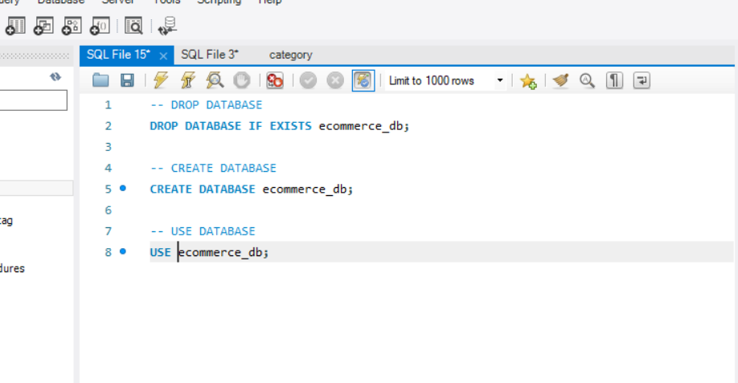

# Back-End-E-Commerce

## Description
A back end for an e-commerce site using Sequelize with an Express.js API.

  ## Table of Contents
  
  * [Installation](#installation)
  
  * [Usage](#usage)
  
  * [License](#license)

  * [Tests](#tests)
  
  * [Questions](#questions)
  
  ## Installation
  
  To install necessary dependencies, run the following command: "npm i".

  To run the server in the CLI: "node server.js".
  
  
  ## Usage

To Create the Schema, run the following syntax in MySQL Workbench:

  
  
Walkthrough Video

  

  
  ## License
    
    This application is licensed under the MIT license.
    

  ## Tests
  
  There are no tests for this application.
  
      
  ## Questions  

  If you have any questions about the repo or application, open an issue or contact me directly at sample. More of my work can be found at [My Github](https://github.com/brob92993).

  [ECommerce Back End Repository](https://github.com/brob92993/Back-End-E-Commerce.git)